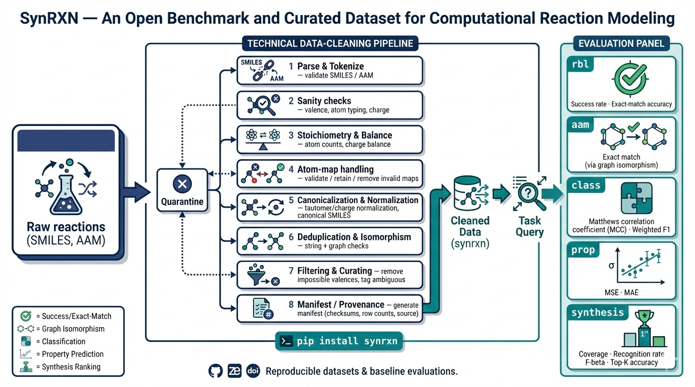

.. _home:

SynRXN
======

.. raw:: html

   <section class="synrxn-intro">
     

       
Reaction benchmark infrastructure

       <h1>Curated reaction benchmarks for reproducible reaction informatics.</h1>
       
SynRXN brings atom mapping, classification, property prediction, rebalancing, and synthesis data into one versioned, citable resource for fair model evaluation.

       
<a href="catalog.html">Browse the benchmark catalog →</a><a href="getting_started.html">Read the quickstart</a><a href="api.html">API reference</a>

     

     <dl class="synrxn-intro-facts">
       
<dt>Coverage</dt><dd>Five reaction task families</dd>

       
<dt>Release model</dt><dd>Versioned, manifest-verified assets</dd>

       
<dt>Evaluation</dt><dd>Published or reproducible splits</dd>

     </dl>
   </section>

.. raw:: html

   

     <a class="synrxn-badge" href="https://pypi.org/project/synrxn/"><i class="fa-brands fa-python" aria-hidden="true"></i> PyPI</a>
     <a class="synrxn-badge" href="https://doi.org/10.1038/s41597-026-07260-w"><i class="fa-solid fa-file-lines" aria-hidden="true"></i> Scientific Data</a>
     <a class="synrxn-badge" href="https://doi.org/10.5281/zenodo.17297258"><i class="fa-solid fa-box-archive" aria-hidden="true"></i> Zenodo</a>
     <a class="synrxn-badge" href="https://github.com/TieuLongPhan/SynRXN"><i class="fa-brands fa-github" aria-hidden="true"></i> GitHub</a>
   

Why SynRXN?
-----------

Benchmarking reaction-informatics methods is difficult when datasets, splits,
reaction representations, and provenance metadata are scattered across releases
or publications. SynRXN solves this by providing a consistent data layout,
version-aware access, documented schema conventions, and reproducible splitting
utilities.

.. raw:: html

   

     

       <i class="fa-solid fa-database" aria-hidden="true"></i>
       <strong>Curated datasets</strong>
       
Compressed CSV records grouped by benchmark task, with stable columns and source citations.

     

     

       <i class="fa-solid fa-code-branch" aria-hidden="true"></i>
       <strong>Version-aware loading</strong>
       
Use archived Zenodo releases, GitHub tags, exact commits, or development snapshots.

     

     

       <i class="fa-solid fa-shuffle" aria-hidden="true"></i>
       <strong>Reproducible splits</strong>
       
Create repeated k-fold or train/validation/test partitions with controlled random seeds.

     

     

       <i class="fa-solid fa-plug" aria-hidden="true"></i>
       <strong>Accessible API</strong>
       
Load datasets as pandas DataFrames and integrate them directly into ML pipelines.

     

   

Framework overview
------------------

   **Figure 1.** Curated reaction datasets are grouped by benchmark task,
   distributed through reproducible releases, loaded through a shared API, and
   evaluated with task-specific workflows.

The SynRXN pipeline separates the data lifecycle into four practical layers:

1. **Curated assets** under ``Data/<task>/<dataset>.csv.gz``.
2. **Versioned distribution** through Zenodo records, GitHub releases, or exact
   Git commits.
3. **Reusable utilities** for loading, caching, manifest handling, and splitting.
4. **Task-specific evaluation** for mapping, classification, property,
   rebalancing, and synthesis workflows.
   
Benchmark collections
---------------------

.. raw:: html

   

     <a class="synrxn-collection-card" href="data_records.html#reaction-rebalancing">
       <i class="fa-solid fa-scale-balanced" aria-hidden="true"></i> RBL
       <strong>Reaction rebalancing</strong>
       
Recover chemically balanced reactions when reactants, products, solvents, catalysts, or auxiliary species are missing.

     </a>

     <a class="synrxn-collection-card" href="data_records.html#atom-to-atom-mapping">
       <i class="fa-solid fa-atom" aria-hidden="true"></i> AAM
       <strong>Atom-to-atom mapping</strong>
       
Evaluate predicted atom correspondences against curated, rule-based, or consensus reference mappings.

     </a>

     <a class="synrxn-collection-card" href="data_records.html#reaction-classification">
       <i class="fa-solid fa-tags" aria-hidden="true"></i> CLS
       <strong>Reaction classification</strong>
       
Assign reaction classes, named-reaction labels, template identifiers, or hierarchical enzyme annotations.

     </a>

     <a class="synrxn-collection-card" href="data_records.html#reaction-property-prediction">
       <i class="fa-solid fa-chart-line" aria-hidden="true"></i> PROP
       <strong>Property prediction</strong>
       
Model kinetic, thermodynamic, and experimental reaction properties such as barriers, enthalpies, rates, yields, and free energies.

     </a>

     <a class="synrxn-collection-card" href="data_records.html#synthesis-prediction">
       <i class="fa-solid fa-flask" aria-hidden="true"></i> SYN
       <strong>Synthesis prediction</strong>
       
Support forward synthesis, retrosynthesis, reagent prediction, condition recommendation, and reaction-center identification.

     </a>

     <a class="synrxn-collection-card todo" href="data_records.html#mechanism-prediction">
       <i class="fa-solid fa-gears" aria-hidden="true"></i> MECH
       <strong>Mechanism prediction</strong>
       
TODO: add datasets for elementary steps, intermediates, and mechanistic pathways.

     </a>
   

Quick example
-------------

Install SynRXN, load a released classification benchmark, and inspect the first
records:

.. code-block:: bash

   pip install synrxn

.. code-block:: python

   from pathlib import Path
   from synrxn.data import DataLoader

   loader = DataLoader(
       task="classification",
       source="zenodo",
       version="1.0.0",
       cache_dir=Path("~/.cache/synrxn").expanduser(),
   )

   print(loader.available_names())
   df = loader.load("schneider_b")
   print(df.head())

Citation
--------

If you use SynRXN in published work, cite the primary data descriptor and the
exact Zenodo version used for your data archive. 

.. code-block:: bibtex

   @article{phan2026synrxn,
     title = {SynRXN: An Open Benchmark and Curated Dataset for Computational Reaction Modeling},
     author = {Phan, Tieu-Long and Nguyen Song, Nhu-Ngoc and Stadler, Peter F.},
     journal = {Scientific Data},
     volume = {13},
     pages = {625},
     year = {2026},
     doi = {10.1038/s41597-026-07260-w},
     url = {https://www.nature.com/articles/s41597-026-07260-w}
   }

.. toctree::
   :caption: Documentation
   :maxdepth: 2
   :hidden:

   Getting Started <getting_started>
   Data Concept <data_concept>
   Dataset Catalog <catalog>
   Parquet Queries and Service <query_and_service>
   AAM Validation <aam_validation>
   Data Records <data_records>
   Tutorials and Examples <tutorials_and_examples>

.. toctree::
   :caption: Section Navigation
   :maxdepth: 1
   :hidden:

   What's New <whats_new>
   API Reference <api>
   Paper <paper>
   Issues <issues>
   References <reference>
